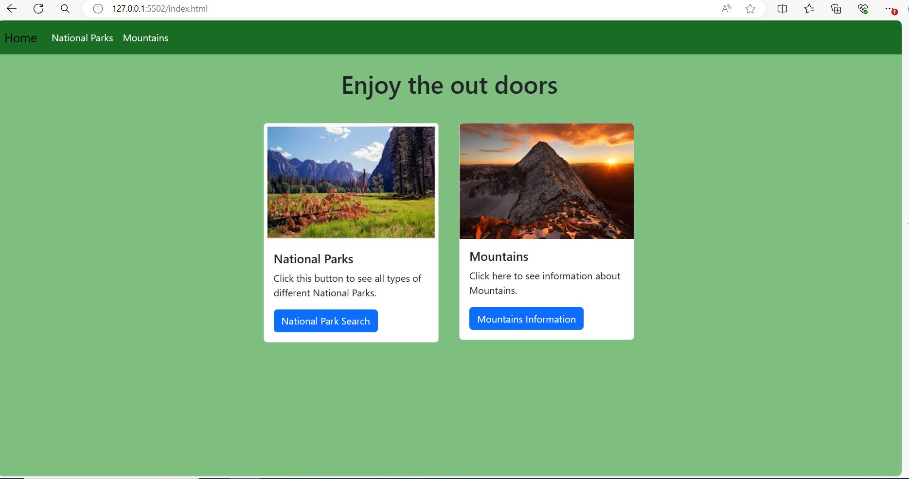
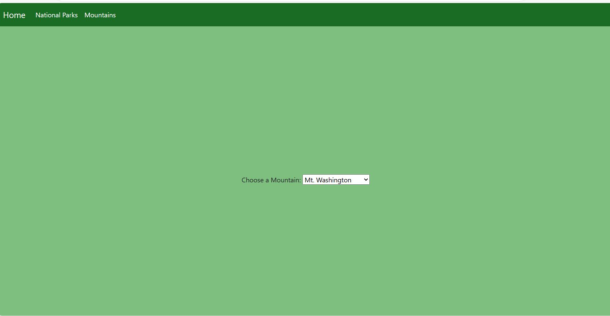
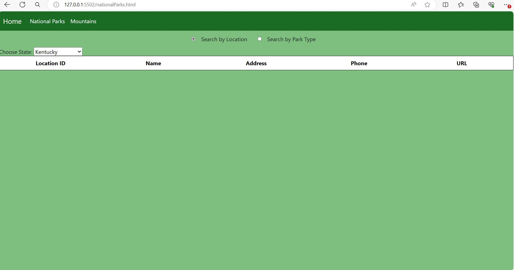

# Capstone-2-Enjoy-The-Outdoors
 A website that helps a user find things to do to enjoy the great outdoors. The site specializes in finding national parks to enjoy and mountains to climb. Utiliznging HTML, CSS, and JavaScript.

# The pages include
Home - Features samples of the parks and mountains in a card with a link to the appropriate page.

Mountains - Features a dropdown that allows users to select a mountain from a predefined list.

Parks - Features two buttons to filter by either type of park, or the state the park is in.

# Home

# Mountains

# Parks

# Interesting Script
The interesting thing i made the table to diplay the information from the array dynamicly

    function parkTemplate(park){
        let tableRow = `
        <tr>
            <th scope="row" class="text-center">${park.LocationID}</th>
            <td class="text-center">${park.LocationName}</td>
            <td class="text-center">${park.Address}</td>
            <td class="text-center">${park.Phone}</td>
            <td class="text-center">${park.Visit || ''}</td>
        </tr>`;
        info.innerHTML += tableRow;
    }